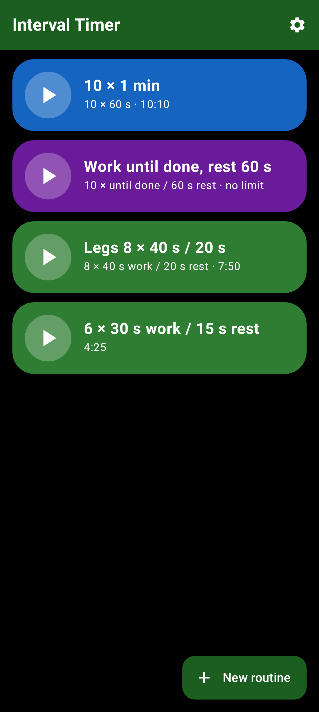
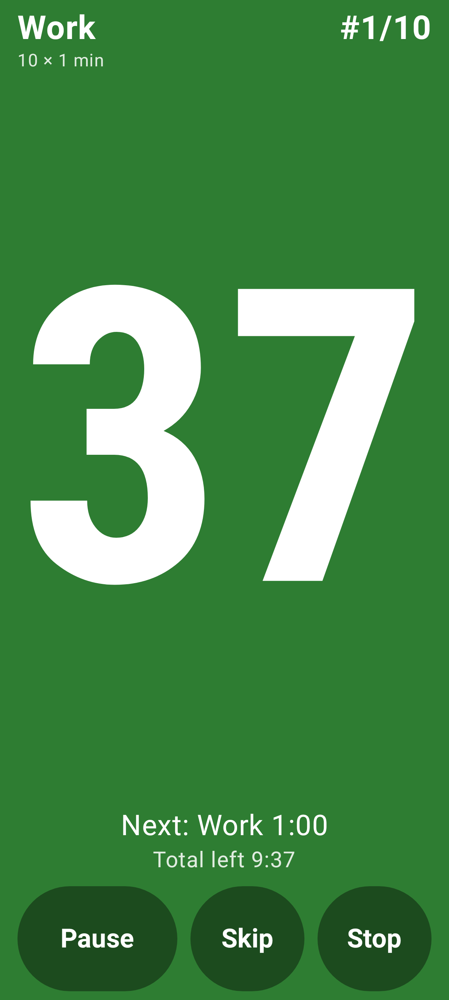
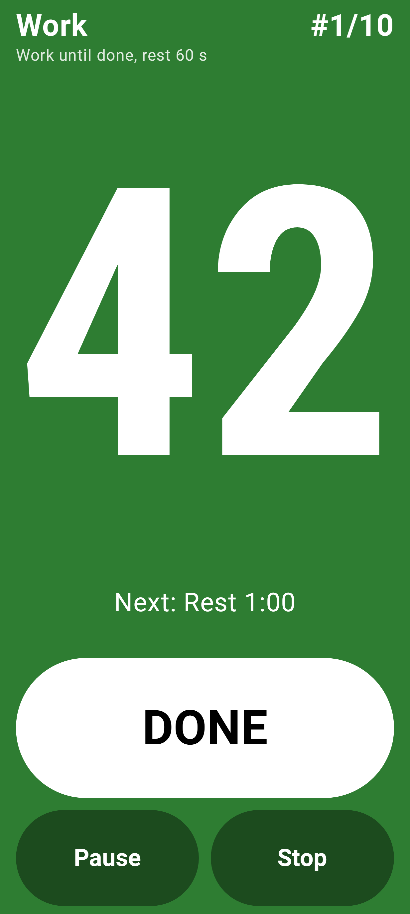

# Interval Timer

A personal, ad-free interval timer for Android, built for the gym: one tap starts a saved routine, and the whole screen changes colour with the phase so you can read it from across the room.

<p>
  
  
  
</p>

## Features

- **Saved routines, one tap to start.** Repeats of work and rest (e.g. 10 × 1 min), a plain timer, or blocks with several phases, warm-up and cool-down.
- **Work until done.** When you don't know how long a set takes, the timer counts up, you press **Done**, and a fixed rest counts down before the next set.
- **Readable from a distance.** Huge digits, the full screen in the phase colour, the next phase and total time left, big pause / skip / stop buttons.
- **Its own volume.** A timer volume slider separate from media volume, optional ducking of your music while a cue plays, spoken phase names, a 3-2-1 countdown.
- **Sound, sound and vibration, or vibration only.**
- **Survives screen-off.** Runs as a foreground service with a notification (pause, resume, skip) and keeps the screen on while running, if you want.
- **No confirmation dialogs.** Stop and delete happen at once, with a 3-second undo.
- **No ads, no accounts, no network.**

## Install

The app is not on the Play Store. Download the APK from the [Releases](../../releases) page, or add `https://github.com/bicanjirka/interval-timer` to [Obtainium](https://obtainium.imranr.dev/) to get updates automatically.

Requires Android 15 or newer (minSdk 35); developed and used on a Pixel with Android 17.

## Build

Kotlin, Jetpack Compose and Material 3 Expressive. You need JDK 25 and the Android SDK.

```
./gradlew assembleDebug testDebugUnitTest   # build and run the unit tests
./gradlew installDebug                      # install on a connected device
./gradlew recordRoborazziDebug              # render every screen to app/build/screens/*.png
```

On Windows use `./gradlew.bat`.

## How it is put together

- `engine`: the pure-Kotlin timer. It computes the current phase and time left from elapsed monotonic time and the routine, never by counting ticks, so pause, resume and late ticks stay exact.
- `service`: the foreground service and the cue player (beeps, speech, vibration).
- `data`: routines as JSON in DataStore, plus settings.
- `ui`: stateless Compose screens; screenshots are rendered on the JVM with Robolectric and Roborazzi.

Design notes and decisions are in [`CLAUDE.md`](CLAUDE.md); open items and the on-phone checklist are in [`TODO.md`](TODO.md).

## Releases

Pushing a tag such as `v1.0.0` runs the tests, builds a signed APK and publishes it as a GitHub Release (see `.github/workflows/release.yml`).
